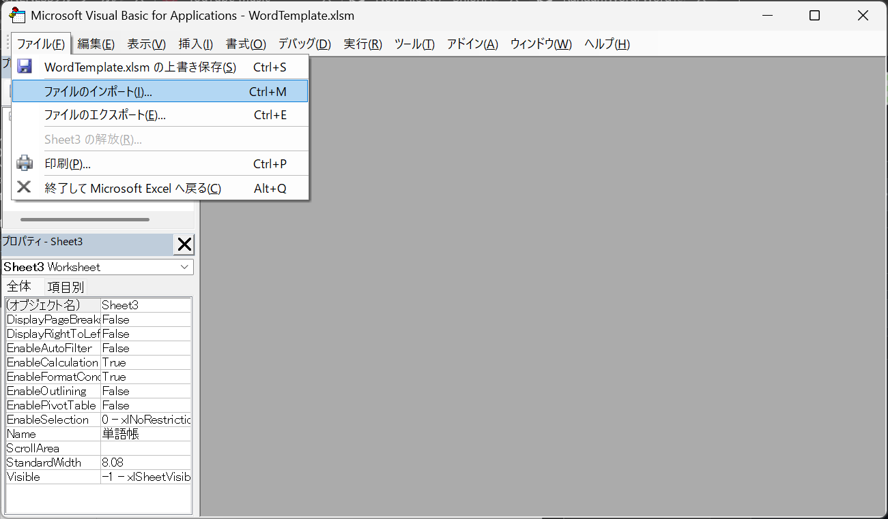
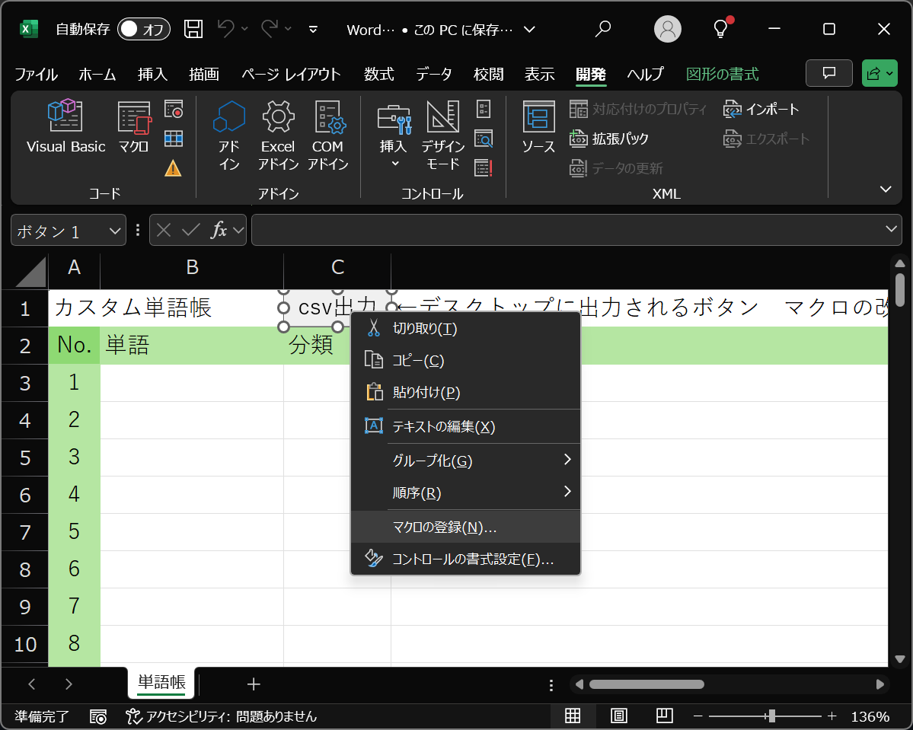

# マクロの登録手順

GitHubにある `.xlsm` ファイルはマクロが無効になっている場合があります。  
このページでは、Excelに `.bas` ファイルを読み込んで、  
マクロボタンを正しく動かすための手順を説明します。

---

## 1. マクロ有効な形式で保存されているか確認

ファイル名が **`.xlsm`（マクロ有効ブック）** になっているか確認してください。  
`.xlsx` に変換して保存するとマクロは無効になります。

---

## 2. Visual Basic Editor（VBE）を開く

WordTemplate.xlsmを開いた状態で、  
**`Alt` + `F11`** を押すと VBE（マクロ編集画面）が開きます。

---

## 3. `.bas` ファイルを読み込む

メニューから **[ファイル] → [ファイルのインポート]** を選択し、  
GitHubにある `Module1.bas` を読み込んでください。

読み込むと、左側の「モジュール」に `Module1` が追加されます。

---

## 4. Excelに戻って、ボタンにマクロを割り当てる

Excel側に戻り、マクロを動かしたい**ボタンを右クリック**して、  
**[マクロの登録]** を選択します。

---

## 5. マクロを選択して割り当て

表示された一覧から、読み込んだマクロ名（例：`ExportToCSV`）を選択し、**[OK]**

これで、ボタンからマクロが実行できるようになります。

---

## 補足

- マクロを実行するには、**ファイル上部の「コンテンツの有効化」を押す必要がある**場合があります
- 変更後は `.xlsm` のまま保存してください
- 編集後に警告が出た場合は「マクロを有効にする」を選択してください

---

以上で設定完了です。
